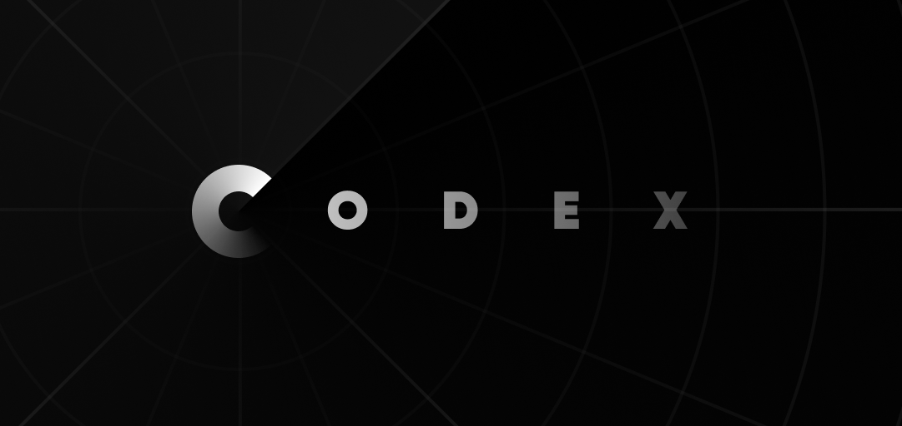

# Codex

<div align="center">
  
  
  **A powerful, customizable TipTap-based editor for writing articles, case studies, and blog posts**
  
  [](https://github.com/wireframe-studio/codex)
  [](LICENSE)
  [](https://nextjs.org/)
  [](https://tiptap.dev/)
</div>

---

## About

**Codex** is an open-source, multi-user article editor built with TipTap and Next.js. It's designed for teams and individuals who need a powerful, customizable platform for creating and managing content like case studies, blog posts, and technical articles.

Created by [Wireframe Studio](https://wireframe.hr) — the experimental R&D arm of Wireframe Company — Codex powers the official Wireframe website and serves as a foundation for empowering team members to create portfolio-worthy content.

## ✨ Features

### 🎨 Rich Text Editor

- **TipTap-powered** with extensive customization options
- **Rich formatting**: Bold, italic, strikethrough, headings, lists
- **Smart links** with auto-detection and custom protocols
- **Custom extensions** for specialized content blocks
- **Drag & drop** support for intuitive content organization
- **History management** with undo/redo functionality

### 🖼️ Media Management

- **S3/Cloudflare R2 integration** for file storage
- **Image upload** with background removal capabilities
- **Gallery components** for image collections
- **Image-text blocks** for rich media content
- **File management** with automatic cleanup

### 👥 Multi-User Support

- **User authentication** and role management
- **Article visibility controls** (public/private/company-wide)
- **Portfolio integration** for personal content
- **Company homepage** featuring for exceptional articles
- **Collaborative editing** capabilities

### 🔌 Public API

- **RESTful API** with API key authentication
- **Article listing** and retrieval endpoints
- **File download** and management
- **Real-time updates** via tRPC
- **Type-safe** with TypeScript and Zod validation

### 🎯 Content Types

- **Blog posts** for regular content
- **Case studies** for detailed project documentation
- **Custom content blocks** for specialized layouts
- **Tagging system** for content organization
- **Analytics tracking** for views and engagement

## 🚀 Quick Start

### Prerequisites

- Node.js 18+ or Bun
- PostgreSQL database
- Cloudflare R2 or AWS S3 bucket

### Installation

1. **Clone the repository**

   ```bash
   git clone https://github.com/wireframe-studio/codex.git
   cd codex
   ```

2. **Install dependencies**

   ```bash
   bun install
   # or
   npm install
   ```

3. **Set up environment variables**

   ```bash
   cp .env.example .env.local
   ```

   Configure the following variables:

   ```env
   DATABASE_URL="postgresql://..."
   CLOUDFLARE_ENDPOINT="https://..."
   CLOUDFLARE_ACCESS_ID="..."
   CLOUDFLARE_ACCESS_KEY="..."
   CLOUDFLARE_R2_BUCKET_NAME="..."
   ```

4. **Set up the database**

   ```bash
   bun run db:push
   # or
   npm run db:push
   ```

5. **Start the development server**

   ```bash
   bun dev
   # or
   npm run dev
   ```

6. **Open your browser**
   Navigate to [http://localhost:3000](http://localhost:3000)

## 📖 Usage

### Creating Articles

1. **Access the editor** through the web interface
2. **Choose content type** (Blog Post or Case Study)
3. **Write your content** using the rich text editor
4. **Add media** by uploading images or files
5. **Set visibility** (private, public, or company-wide)
6. **Publish** when ready

### API Integration

#### Authentication

Include your API key in the request headers:

```bash
curl -H "Authorization: Bearer YOUR_API_KEY" \
     https://your-codex-instance.com/api/trpc/access.article.list
```

#### Fetch Articles

```javascript
const response = await fetch('/api/trpc/access.article.list', {
	headers: {
		Authorization: 'Bearer YOUR_API_KEY'
	}
});
const { articles } = await response.json();
```

#### Get Specific Article

```javascript
const response = await fetch('/api/trpc/access.article.getById', {
	method: 'POST',
	headers: {
		'Content-Type': 'application/json',
		Authorization: 'Bearer YOUR_API_KEY'
	},
	body: JSON.stringify({
		articleId: 'article-id-here'
	})
});
```

## 🛠️ Customization

### TipTap Extensions

Codex comes with a modular extension system. You can easily add custom extensions:

```typescript
// src/deps/tiptap/extensions.ts
import { YourCustomExtension } from './extensions/your-extension';

export const tiptapExtensionsEditable: Extensions = [
	...baseExtensions,
	YourCustomExtension,
	History
];
```

### Custom Content Blocks

Create specialized content blocks for your use case:

```typescript
// Example: Custom testimonial block
const TestimonialExtension = Node.create({
	name: 'testimonial',
	group: 'block',
	content: 'paragraph+'
	// ... configuration
});
```

### Styling

Customize the appearance using Tailwind CSS:

```css
/* src/styles/tiptap.css */
.element-heading {
	@apply text-2xl font-bold mb-4;
}

.element-paragraph {
	@apply mb-4 leading-relaxed;
}
```

## 🏗️ Architecture

### Tech Stack

- **Frontend**: Next.js 15, React 19, TypeScript
- **Editor**: TipTap 2.12 with custom extensions
- **Backend**: tRPC for type-safe APIs
- **Database**: PostgreSQL with Prisma ORM
- **Storage**: Cloudflare R2 (S3-compatible)
- **Styling**: Tailwind CSS with custom components
- **Authentication**: JWT-based with bcrypt

### Project Structure

```
src/
├── app/                 # Next.js app router
├── deps/               # Shared dependencies
│   ├── tiptap/         # TipTap extensions and components
│   ├── trpc/           # tRPC configuration
│   └── shadcn/         # UI components
├── modules/            # Feature modules
│   ├── article/        # Article management
│   ├── access/         # Public API access
│   ├── file/           # File handling
│   └── editor/         # Editor interface
└── global/             # Global components and utilities
```

## 🤝 Contributing

We welcome contributions! Here's how you can help:

1. **Fork the repository**
2. **Create a feature branch**: `git checkout -b feature/amazing-feature`
3. **Commit your changes**: `git commit -m 'Add amazing feature'`
4. **Push to the branch**: `git push origin feature/amazing-feature`
5. **Open a Pull Request**

### Development Guidelines

- Follow the existing code style
- Add tests for new features
- Update documentation as needed
- Ensure TypeScript types are properly defined

## 📄 License

This project is licensed under the MIT License - see the [LICENSE](LICENSE) file for details.

## 🙏 Acknowledgments

- [TipTap](https://tiptap.dev/) for the amazing editor framework
- [Next.js](https://nextjs.org/) for the React framework
- [tRPC](https://trpc.io/) for end-to-end typesafety
- [Prisma](https://prisma.io/) for database management
- [Tailwind CSS](https://tailwindcss.com/) for styling

## 🔗 Links

- **Live Demo**: [wireframe.hr](https://wireframe.hr)
- **Documentation**: [Coming Soon]
- **Issues**: [GitHub Issues](https://github.com/wireframe-studio/codex/issues)
- **Discussions**: [GitHub Discussions](https://github.com/wireframe-studio/codex/discussions)

---

<div align="center">
  <p>Made with ❤️ by <a href="https://wireframe.hr">Wireframe Studio</a></p>
  <p>Part of the <a href="https://wireframe.hr">Wireframe Company</a> collective</p>
</div>
